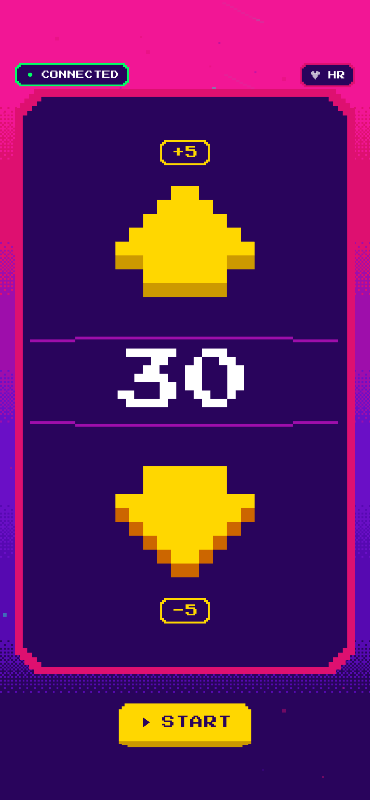
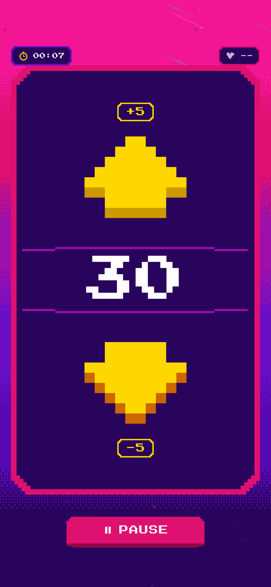
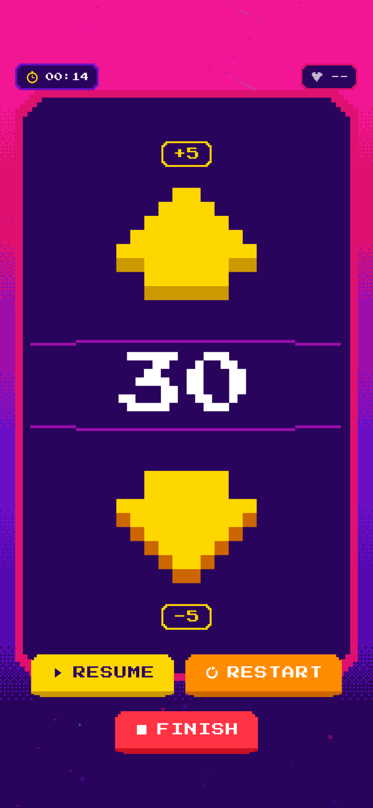
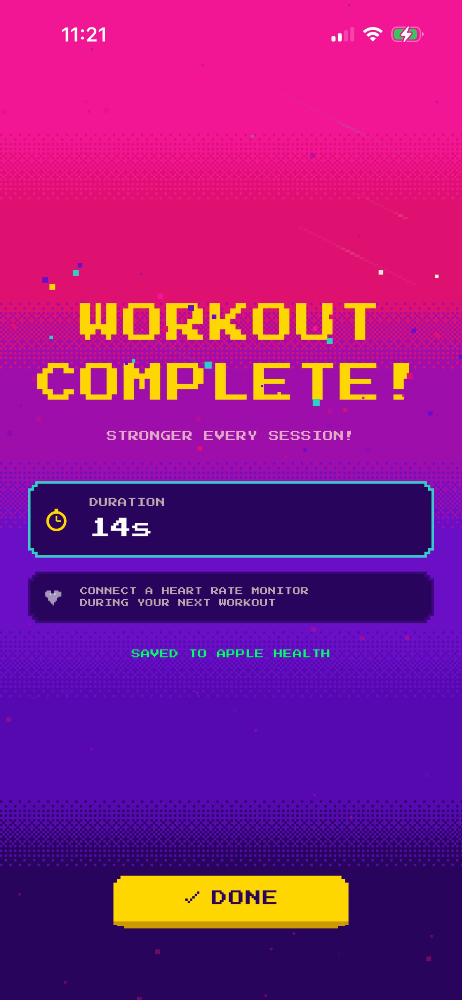

# Resistance Control App

A simple Flutter app to control the resistance level of a Wahoo Kickr Core 2 smart trainer via Bluetooth, independent of Zwift.

<p align="center">
  
  
  
  
  
</p>

## Download

Available on [TestFlight](https://testflight.apple.com/join/ma9zq74d) for iOS.

## Problem

When using a Zwift Ride with Kickr Core 2, there's no way to adjust trainer resistance without running Zwift. This makes standalone workouts (like following a YouTube spin class) impossible without manual resistance control.

## Solution

A minimal mobile app with two buttons (up/down) and a percentage display (0-100%) that connects directly to the Kickr Core 2 via Bluetooth FTMS protocol.

## Features

### Resistance Control
- Connect to Kickr Core 2 via Bluetooth
- Display current resistance (0-100% in 5% increments)
- Increase/decrease resistance with large tap targets
- Auto-reconnect to previously paired trainer
- Auto-set to 0% on connection
- Decade-based color feedback (11 colors from green to dark red)
- Smooth fade animations when crossing decade boundaries
- Screen stays awake during use

### Workout Timer
- Start/pause/resume/restart/finish controls
- Elapsed time display (MM:SS or HH:MM:SS)
- Stats bar overlay during active workout
- Workout summary screen with total duration

### Heart Rate Monitor
- Connect BLE heart rate monitors (Polar, Wahoo, etc.)
- Connect before or during workout (HR button in top-right when idle)
- Real-time heart rate display with pulsing heart icon
- Average and max HR tracking
- Confetti celebration on workout completion

### Apple Health Integration
- Workouts automatically saved to Apple Health after completion
- Includes duration, activity type (Cycling), and heart rate samples
- Heart rate zones calculated automatically by Apple Fitness

### Crash Logging
- Firebase Crashlytics integration for automatic crash reporting
- Captures both Flutter and native iOS crashes

### Workout History
- Completed workouts automatically saved to local SQLite database
- Activity list screen with date, duration, and avg HR
- Activity detail screen with HR zone bar chart (5-zone model)
- **Dev tool**: Long-press the HISTORY title for 10 seconds to seed 8 realistic test activities

## Future Enhancements

- Zwift Ride handlebar control integration (use shift buttons to adjust resistance)
- Live power/cadence/speed display
- Preset resistance profiles
- Android support

## Technical Details

- **Framework**: Flutter (cross-platform, iOS first)
- **Bluetooth**: flutter_blue_plus library
- **Protocol**: FTMS (Fitness Machine Service) - Bluetooth SIG standard
- **Trainer Communication**:
  - Service UUID: `0x1826`
  - Control Point: `0x2AD9`
  - Set Resistance: Op Code `0x04`

## Requirements

- iOS 13.0+ (Bluetooth LE required)
- Wahoo Kickr Core 2 (or any FTMS-compatible trainer)
- Apple Developer account (for device installation)

## Development Setup

1. Install Flutter: `brew install --cask flutter`
2. Install Xcode from developer.apple.com
3. Run `flutter pub get` to install dependencies
4. Run `flutter run` to launch on connected device

## Project Structure

```
lib/
├── main.dart                      # App entry point
├── screens/
│   ├── home_screen.dart           # Main resistance control UI
│   ├── scan_screen.dart           # Device scanning/connection
│   ├── workout_summary_screen.dart # Post-workout stats
│   └── hr_scan_sheet.dart         # HR monitor discovery sheet
├── services/
│   ├── ble_service.dart           # Bluetooth FTMS communication
│   ├── workout_service.dart       # Workout timer and state
│   ├── hr_service.dart            # Heart rate monitor BLE
│   ├── health_service.dart        # Apple HealthKit integration
│   ├── activity_service.dart      # SQLite workout storage
│   └── seed_data_service.dart     # Test data generator (dev tool)
└── widgets/
    ├── resistance_control.dart    # Up/Down/Level widget
    ├── workout_stats_bar.dart     # Timer + HR display bar
    ├── workout_controls.dart      # Start/Pause/Finish buttons
    ├── workout_timer_display.dart # Formatted elapsed time
    └── heart_rate_display.dart    # BPM with heart icon
```

## License

MIT
